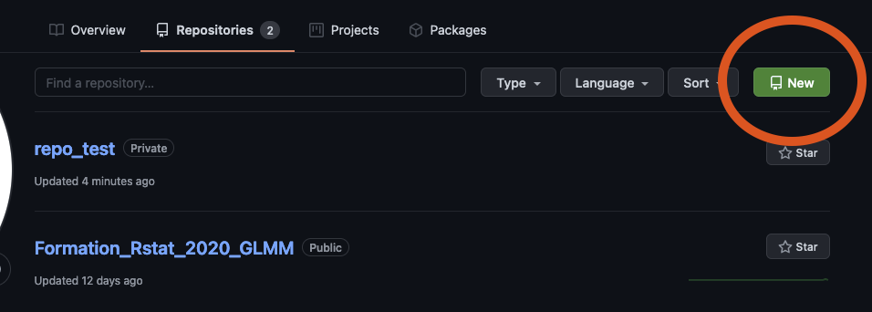
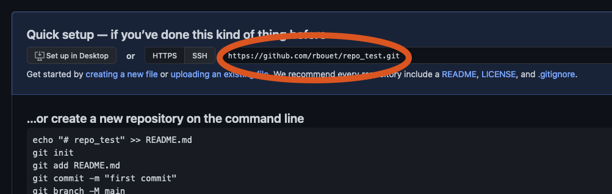
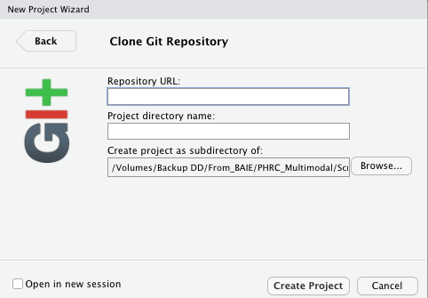
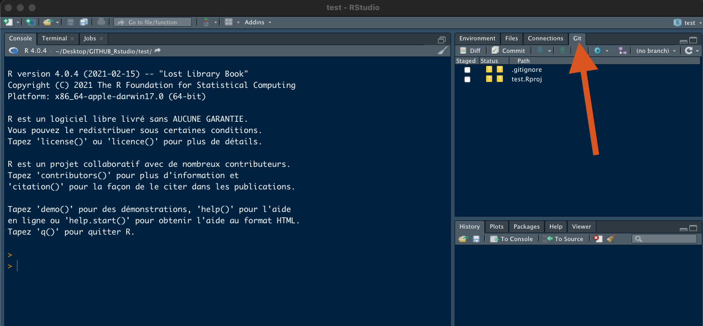
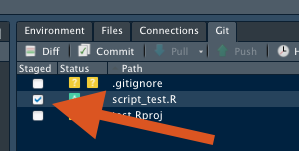
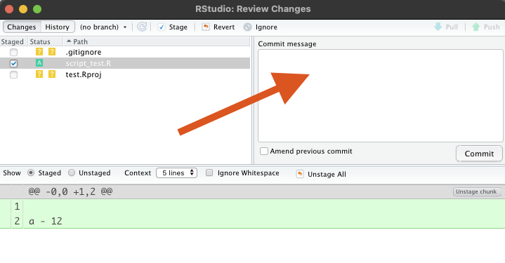
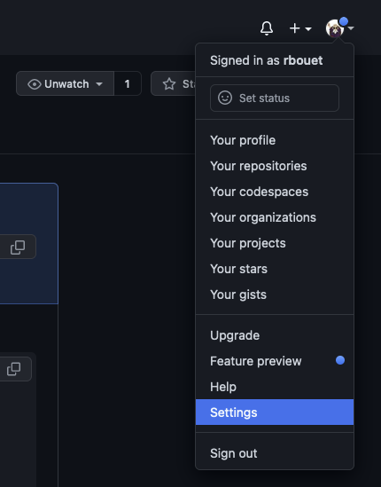
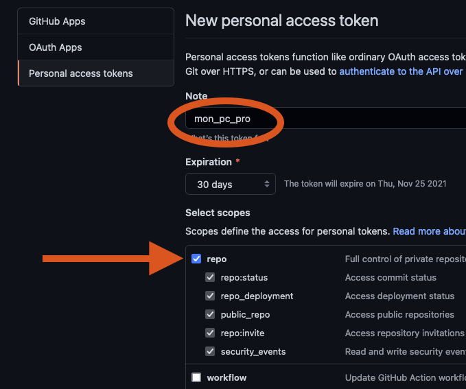
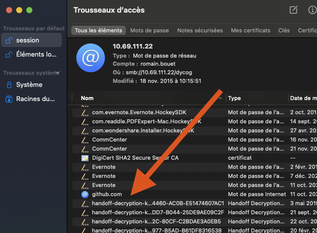
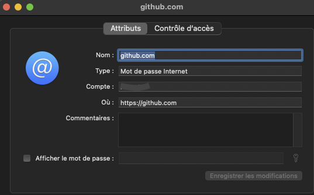

# GITHUB Configuration in Rstudio

The good news is that Git is natively installed in RStudio (recent version). So if you're allergic to the command line, the "Git" window allows you to perform common operations via button-click.   

## Prerequisites

Befor you start to configure GITHUB, we assume the following: :   
- You have registered a free GitHub account (chapter 4).
- You have installed/updated R (https://cran.r-project.org/)   
- You have installed/updated RStudio (https://www.rstudio.com/products/rstudio/download/#download), free version is enought   
- You have installed Git    

## Initializing an R project with Git

The way it works is that an R project is associated with a Git project.   

### GITHUB

The first steps are on the GITHUB site to create a repository (a project).   

Connect to GitHub and click on ***Create new repository***.   

To associate this Git repository with an R project via RStudio, you must make a clone: click on ***Code*** and copy the URL (HTTP/HTTPS).    

That's all from GITHUB !!!    

### Rstudio

In RStudio now.

As we said previously, the spirit is: Rstudio work on an existing GIYHUB repository. So we will create an R project that will point on GITHUB repository and clone it. To do that:      

Clic on ***File*** > ***New Project*** > ***Version Control*** > ***Git***    
Put in the URL/SSH of your repository that you copied beforehand, the name of the R project (the same as Git ideally) and the folder in which to place it, and finally click on Create ***Project***.    

Now you have an empty project (no script), juste an *Project_name.Rproj* file in a directory created for your project in the selected path.   
You win an new onglet ***Git***.   

In this windows you will find a list of file, not pushed yet. But we will come back to this.     

## Use GITHUB daily

### Commit/Push

You find your new or modified files in the Git window. Status field tell if each file is :    

- a new file will be associated with an orange icon containing a 
- This new file will be associated with a green icon containing an A once you have checked it
- A modified file will have a blue icon with an M
- A deleted file will have a red icon with a D

To commit your modifications, you select all the files you need to update in GITHUB. 

Then clic on ***Commit***. Before to send a commit you have to put a message.   

Now you can clic on the ***Commit*** button and ***Push***. At the first commit a code is need. It could be a tricky thing. Try your user code and if it's doesn't work, follow.     

## Code trouble

### Mac solution

You will probably have a problem with the security code. You must secure the link with your device.    
To fix it, got in your ***setting*** profile > ***Developer settings*** > ***Personal access tokens*** > ***Generat new token***   

Now you set two settings:   
- ***Note***, put a label to your device. For instance *"moin_pc_pro"*.    
- Select all the scope for the ***repo*** onglet.    

And ***Generate token***.   

Now copy this token.   
Open ***Keychain Access*** (#apple + space > "keychain access" + Enter).    
Find ***GITHUB.com*** 

Ensure :   
- ***Name*** is a correct *github;com* path    
- ***Account*** is a correct name of your GITHUB account

Clic on ***Show Password*** button and past the token previously copied and ***Save change***.   

now the pushes must work !

